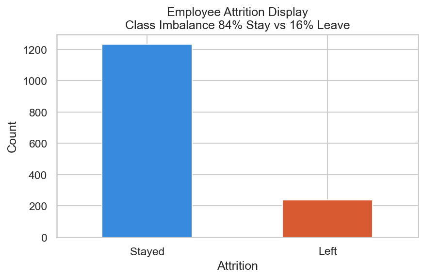
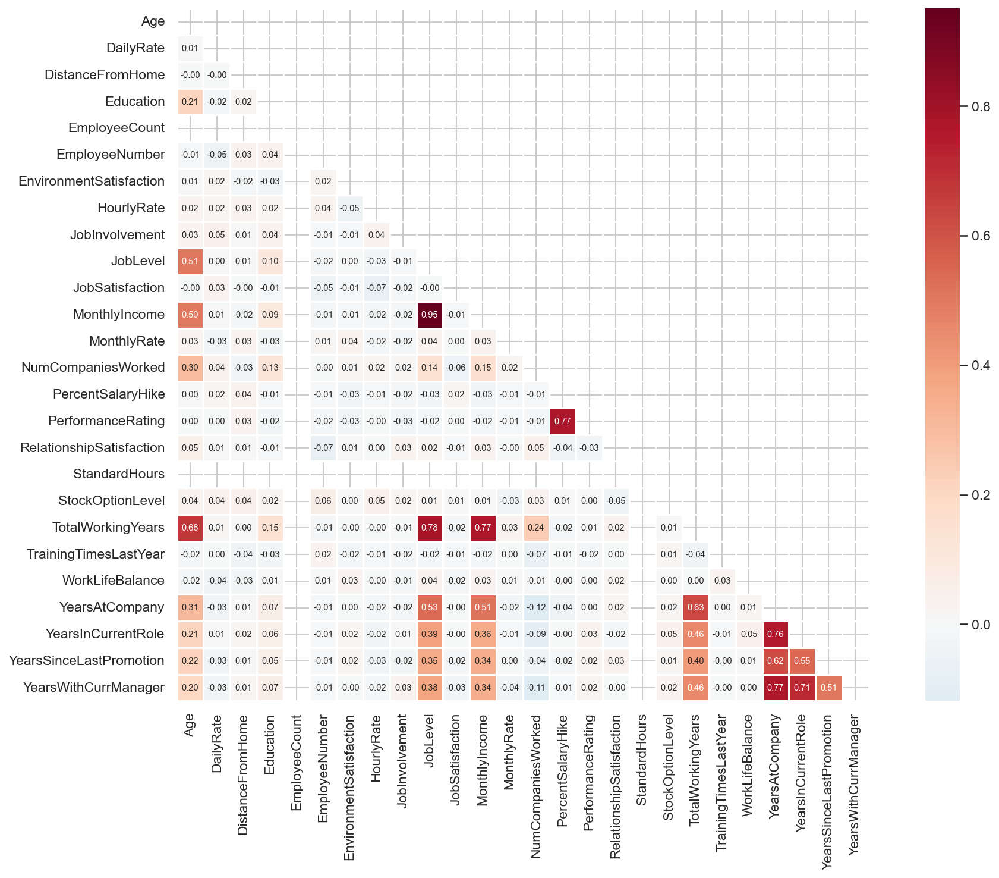

# 👥 Employee Attrition Prediction — Machine Learning Project

> Predicting whether an employee will leave the company  
> Dataset: IBM HR Analytics | 1470 employees | 35 features

---

## 📊 Project Overview

Built an end-to-end Machine Learning pipeline to predict employee 
attrition using Random Forest Classifier. Addressed real-world 
challenges including class imbalance and threshold optimization.

**Goal:** Binary Classification — Will employee leave? Yes / No  
**Algorithm:** Random Forest Classifier (scikit-learn)  
**Dataset:** IBM HR Analytics Dataset (Kaggle)  
**Business Impact:** Retaining one employee saves 6-9 months salary

---

## 🎯 Results

| Model | Accuracy | Recall (Left) | F1 (Left) |
|---|---|---|---|
| Baseline (Dumb) | 84% | 0% | 0% |
| Decision Tree | ~71% | ~X% | ~X% |
| Random Forest | 84% | 34% | 40% |
| RF + Threshold Tuning ✅ | ~84% | ~X% | ~X% |

**Key Metric: Recall** — Missing an employee who leaves  
costs company 6-9 months salary!

---

## 🔍 Key Findings from EDA

- **Sales department** has highest attrition rate
- Employees doing **OverTime** are ~31% more likely to leave
- **Lower income + Single + Young** = highest risk profile
- **Job Satisfaction level 1** shows significantly higher attrition
- Employees living **far from office** tend to leave more

---

## 📁 Project Structure
employee-attrition-prediction/
│
├── attrition_prediction.ipynb     # Main notebook
├── attrition_final_model.pkl      # Saved pipeline + threshold
│
├── images/
│   ├── 01_target_distribution.png
│   ├── 02_age_attrition.png
│   ├── 03_department_attrition.png
│   ├── 04_overtime_attrition.png
│   ├── 05_income_attrition.png
│   ├── 06_satisfaction_attrition.png
│   ├── 07_correlation_heatmap.png
│   └── 08_confusion_matrix_final.png
│
└── README.md

---

## 📈 Key Visualizations

### Target Distribution — Class Imbalance


### OverTime vs Attrition


### Correlation Heatmap


### Confusion Matrix — Final Model


---

## 🚀 How to Run

```bash
# 1. Clone
git clone

# 2. Install
pip install pandas numpy scikit-learn matplotlib seaborn imbalanced-learn

# 3. Run notebook
jupyter notebook attrition_prediction.ipynb
```

---

## 📚 What I Learned

- End-to-end ML Pipeline with sklearn
- Handling Class Imbalance — SMOTE + Threshold Tuning
- Why Recall matters more than Accuracy in HR domain
- ColumnTransformer — industry standard preprocessing
- Feature Importance for business insights
- Model serialization with Pickle

---

## 👤 Author
**Muhammad Anus Naseer**  